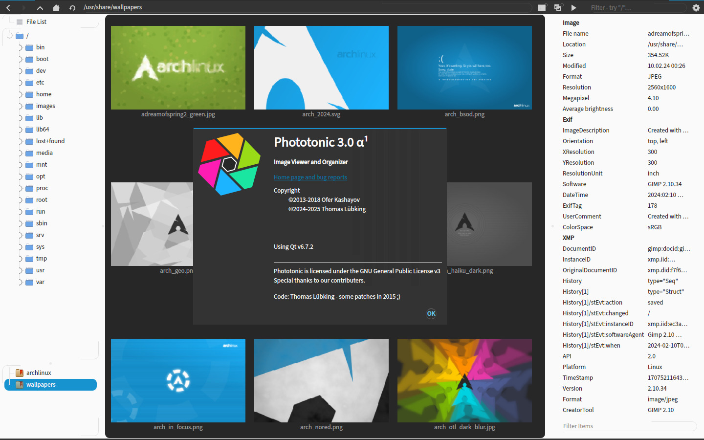

# Phototonic Image Viewer


### About
Phototonic is an image viewer and organizer built with Qt and Exiv2, released under GNU General Public License v3.
The ec1oud fork is for work on batch-processing features: specifically to take a directory full of crooked
webcam shots and align them well enough to make a time-lapse video.

### Features


+ Support for [common image formats](https://doc.qt.io/qt-6/qimage.html#reading-and-writing-image-files) and GIF animation
+ Supports tagging images, and filtering images by tags (IPTC)
+ Browse thumbnails recursively down a folder tree
+ Dynamic thumbnails loading
+ Image transformation and color manipulation
+ Display image information and metadata
+ Does not depend on any desktop environment

---

### Updates:

<a href="https://translate.lxqt-project.org/engage/luebking/?utm_source=widget">

</a>

#### 2. November 2025
Release 3.1.0
* Fixes a race condition on slow thumbnail loading over the alpha release and has more translations.

#### 11. September 2025
First 3.1 alpha
* Basic Exif editing
* Enhanced Exif filtering
* Mass/auto renaming
* Interactive file collision resolution on copy/move
* Filter images by tags
* New image filters for "warm", "cold" and brown
* Much better support for external viewer window (starting with "it no longer crashes")
* Modular translation files
* Bring back the irregular grid for the compact mode (instead of two square displays)
* Nicer viewer toolbar (secretly also configurable)
* Basic screenshot editing (annotate, blackout and encircle)
* Code cleanup
* Fixed some bugs
* Probably added new ones instead

##### 20. April 2025
With the release of 3.0.0 the 3.1 cycle starts into the summer

##### 29. March 2025
Second and final beta of 3.0

Some small bugfixes
- align collation between model and fs and preserve setting
- account for rotation when sliding images around
- upscale preview to match image
- update image info overlay when loading image from thumbviewer
- fix tag subset selection logic
- lazy inode watching

##### 12. March 2025
1st beta release

- Final new features:
  - filter for colors, colorfulness and brightness
  - take an image list from stdin and
  - support bangs to invoke external commands (locate, find, baloo, tracker, …) to generate image lists from the path bar
  - allow phototonic to run as singleton (ie. subsequent starts remote-control the existing process)
- Some UI tweaks
  - most notably removed various questionable auto-scale options for sane defaults and dynamic adjustment
- More code clean-up
- Fixed bugs (mostly just introduced ones) - and I just realized one more (but completely uncritical and it's too late now)

##### 23. February 2025
3rd and omega alpha release

+ lots of code cleanup and bugfixes
+ the biggest changes are that
  + the filter now operates on the view instead of reloading the directory
  + the duplicate search incorporates histogram similarity to find potential duplicates
  + the filesystem is monitored and updated on external changes (new images saved by gimp show up automatically)
+ animated zoom and rotation and multithreaded color correction and also transactions (move/delete) are aplied to the thumbnail cache
+ I hopefully didn't introduce too many bugs…


##### 7. February 2025
Second alpha release
+ Proper thread usage - snappier behavior, less crashes
+ Reviewed the entire tag handling
+ lot's of fixes when using the viewer as preview (including the crop rect)
Improve colorizing performance
+ sort by exif date
+ lots of UI tweaks and bug fixes
+ introduced a couple of bugs (likely)

##### 27. January 2025
First alpha release

##### January 2025
+ OpenGL for the the image viewer
+ Load images outside the GUI thread
+ Cleaned up the GUI / restructured features
+ Improved performance by
  + avoiding and deferring expensive actions and
  +  utilizing the thumbnails for heuristics
+ Loads of code refactoring
+ Fixed many, many bugs…
+ Added many, many bugs (probably)

##### December 2024
+ revive and Qt6 port

##### 11 Mar 2018 - v2.1
+ Rotate preview by Exif rotation
+ Fixed bug in image filtering
+ Bug fixes for multiple UI issues and actions
+ Add shortcuts for all missing actions

##### 28 Feb 2018 - v2.0
+ Move to Trash
+ File List support
+ Bug fixes

##### 15 Jan 2018 - v2.0 - Snapshot
+ Back after a long break
+ Code cleanup and removal of useless features
+ Lots of bug fixes
+ Added Remove Image Metadata action
+ Enhanced keyboard settings
+ Enhanced image info

##### 12 Nov 2015 - v1.7.1
+ Changes to the way layouts are being switched, now faster and more efficient
+ Fixed issue with not reading image tags correctly when exif data was missing from image
+ Added Negate option to image tags filtering
+ Docks can now be nested to create more customized layouts
+ Some enhancements to Tags user experience and icons
+ Fixed issue with limited zoom functionality
+ Better error handling when reading corrupted images
+ New translations added

##### 8 Aug 2015 - v1.6.17
+ Image tags improvements and bug fixes
+ Changes to default key mapping
+ Small fixes to image extensions
+ Fixed issue with thumb label appearing after rename when labels are not displayed
+ Improvements to image feedback
+ Some dialog usability fixes
+ Added Negativity settings per color channel
+ Fixed colors manipulations for images with alpha channel and non animated GIF images
+ Other Bug fixes

[Older updates](HISTORY.md)

##### Optional Dependencies
+ qt6-imageformats (TIFF and TGA support)
+ qt6-svg (SVG support)

##### Quick Build Instructions on Linux
```
$ tar -zxvf phototonic.tar.gz
$ cd phototonic
$ qmake
$ make
$ make install
$ sudo make install
```

##### Building on Windows
Building on Windows is only supported with mingw at the moment (the source code is probably compatible with msvc, but this was not tested yet).
First get the exiv2 library. Binary version is available from http://www.exiv2.org/download.html (download mingw version) or build it manually.

Note that Qt libraries must be built against the same major mingw version as exiv2 is built against (i.e. Qt built with mingw 5 and higher won't be compatible with exiv2 built with mingw 4.9).
Currently exiv2 binary package for mingw is built with mingw 4.9 therefore the latest compatible Qt version available in binary is 5.6.3 (available via Qt Maintenance Tool).

If using the binary package from exiv2 website, unpack the `mingw` directory to the root of the repository (only mingw/lib and mingw/include are essential).
Then build phototonic as usual - via qmake + mingw32-make in the console, or via QtCreator (remember to choose the compatible Qt Kit).
